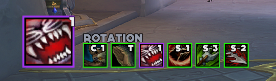
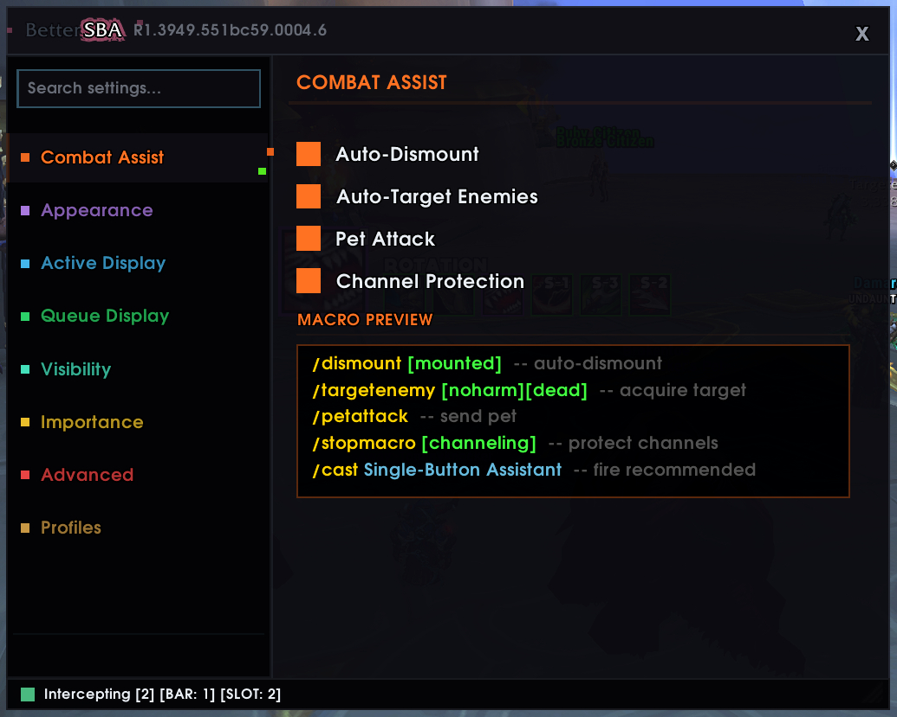
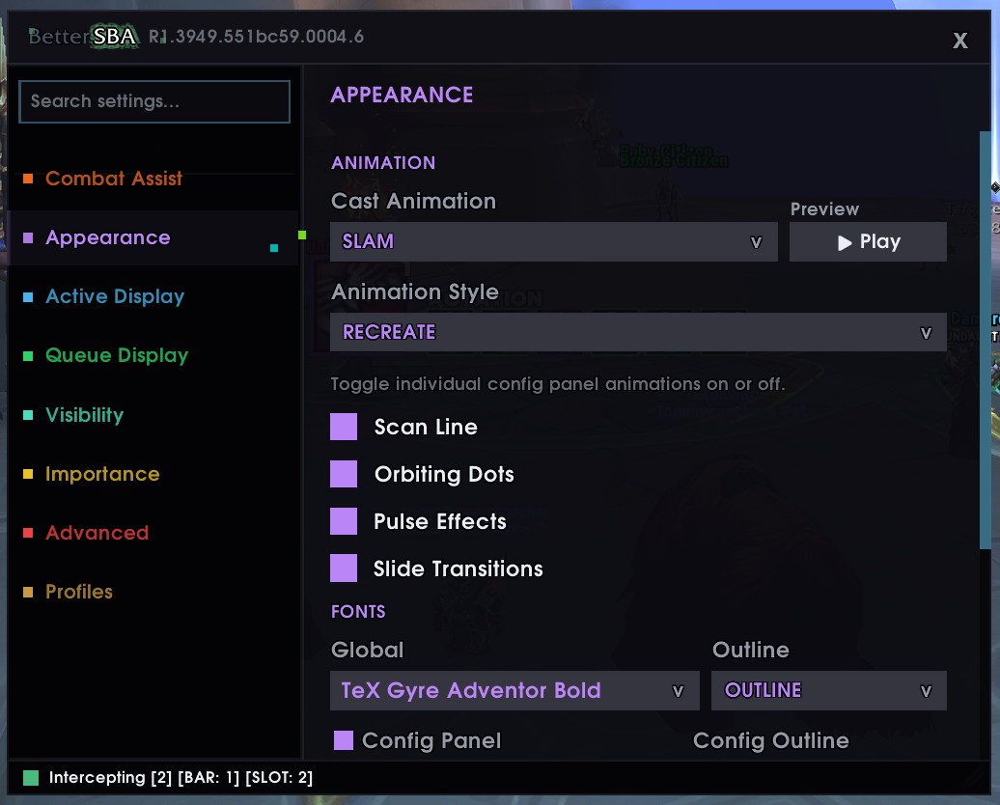
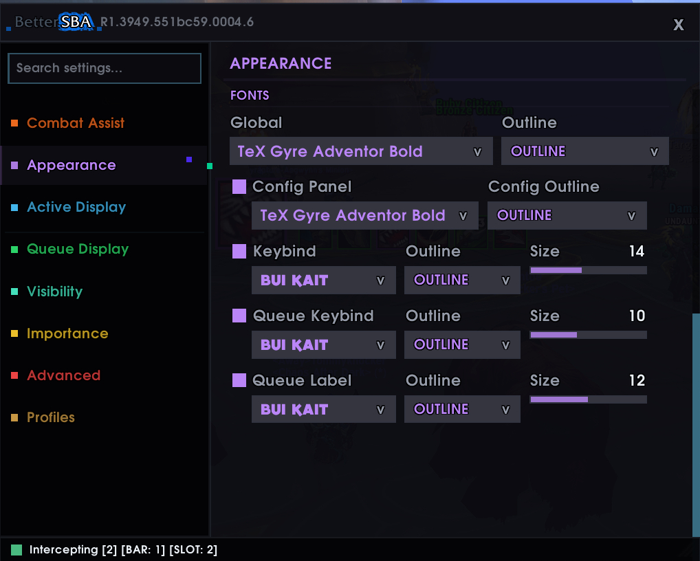
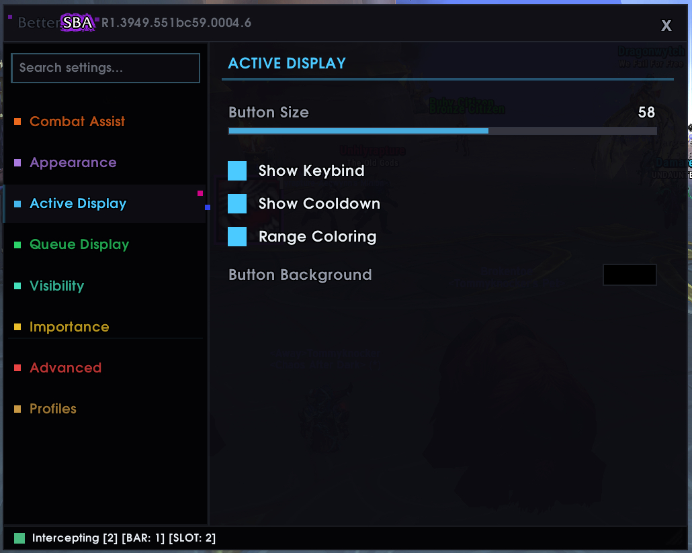
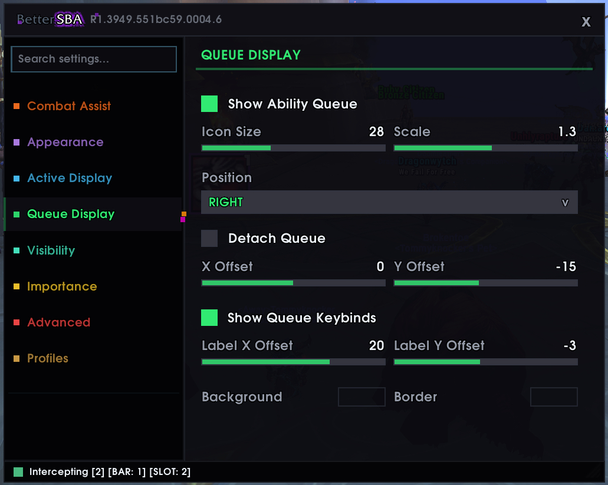
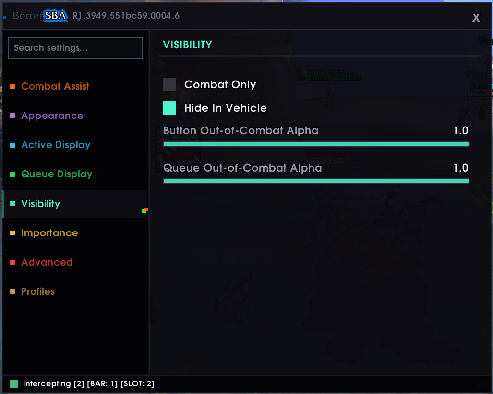
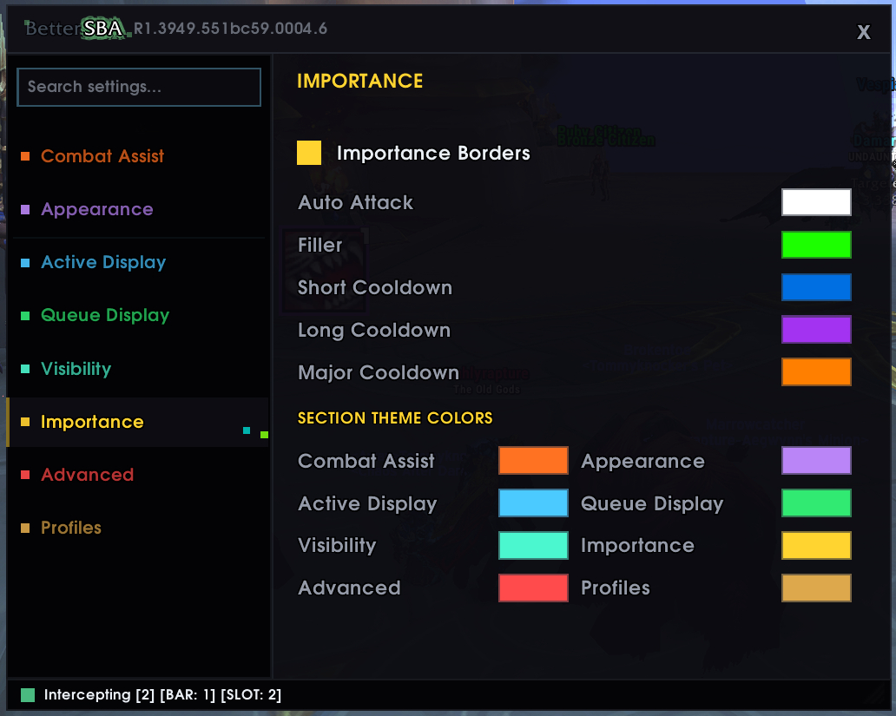
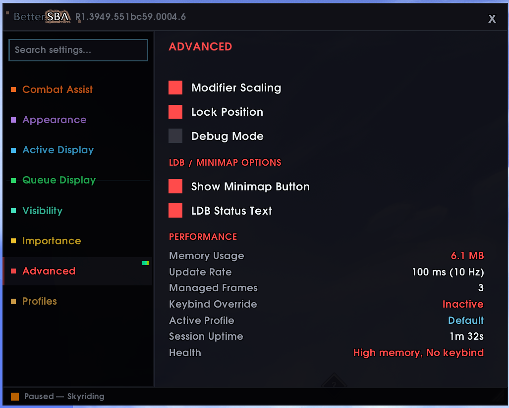
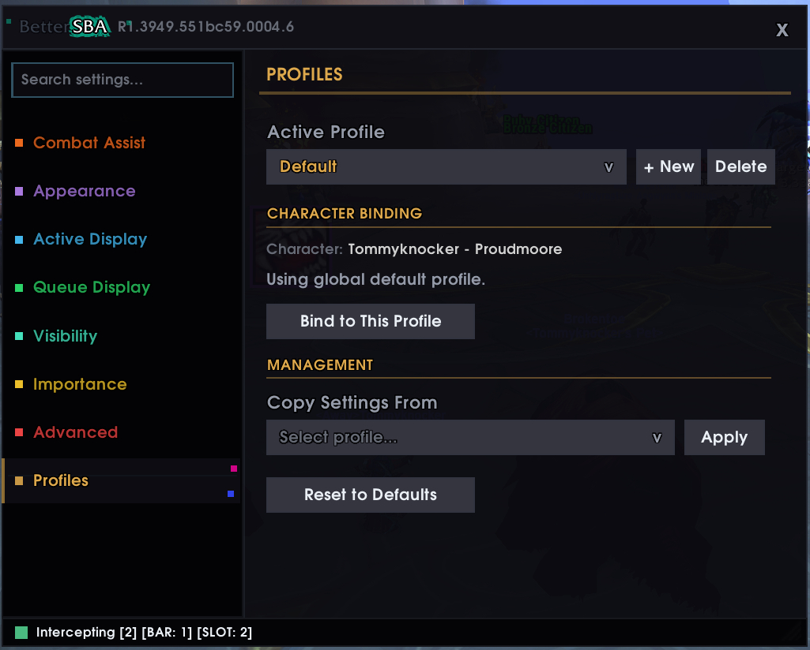

<p align="center">
  
  
  
</p>

<h1 align="center">
  <code style="background:none;border:none;">Better</code><strong>SBA</strong>
</h1>

<p align="center">
  <em>Enhanced Single-Button Assistant for World of Warcraft</em>
</p>

<p align="center">
  <code>/targetenemy [noharm][dead]</code> &middot; <code>/petattack</code> &middot; <code>/stopmacro [channeling]</code> &middot; <code>/cast SBA</code>
</p>

---

## What is this?

BetterSBA wraps the **Single-Button Assistant** (Assisted Combat) into a `SecureActionButton` with `/targetenemy`, `/petattack`, and channel protection baked into one keypress.

Press your keybind &rarr; auto-target nearest enemy &rarr; send pet &rarr; protect channels &rarr; cast. No more tab-targeting before every press.

It also gives you a **rotation queue display** showing your full SBA spell pool with cooldowns, importance borders, and range coloring &mdash; everything the default SBA button doesn't show you.

---

## Screenshots

<p align="center">
  
  <br />
  <em>Main button with rotation queue, importance borders, keybinds, and cooldowns</em>
</p>

| | |
|---|---|
|  |  |
| **Combat Assist** &mdash; auto-target, pet attack, dismount, channel protection, and live macro preview | **Appearance &mdash; Animation** &mdash; cast animation type &amp; style, with live preview |
|  |  |
| **Appearance &mdash; Fonts** &mdash; per-context font, outline, and size with override toggles | **Active Display** &mdash; button size, keybind text, cooldown, range coloring, background |
|  |  |
| **Queue Display** &mdash; icon size, scale, position, detach, offset, keybinds, and border | **Visibility** &mdash; combat-only mode, vehicle hiding, button &amp; queue alpha |
|  |  |
| **Importance** &mdash; cooldown tier border colors and section theme colors | **Advanced** &mdash; modifier scaling, lock, debug, minimap/LDB, and live performance stats |
|  | |
| **Profiles** &mdash; create, switch, copy, reset, delete, and per-character binding | |

---

## Features

<table>
<tr>
<td width="50%" valign="top">

### Keybind Interception
Automatically hooks your existing SBA action bar keybind. The macro fires when you press your normal hotkey &mdash; not just when clicking the BetterSBA button. Works with default bars, Bartender4, ElvUI, and Dominos.

### Rotation Queue
Shows your SBA rotation pool as icons beside the main button. Configurable icon size, scale, position (8 anchor points), per-icon cooldowns, keybind labels, and importance-colored borders based on spell cooldown tiers.

### Cast Animations
5 animation types: **Drift**, **Pulse**, **Spin**, **Zoom**, **Slam**. Two styles &mdash; **Keep** (button stays, clone animates away) or **Recreate** (old icon animates out, new icon fades in). Live preview button in config.

### Profiles
Multiple named profiles with per-character bindings. Create, copy, rename, reset, and switch profiles. All characters share a global default unless overridden. Settings migrate automatically from older versions.

### Search Settings
Type to filter across all config sections. Matching options highlight instantly &mdash; no scrolling through menus to find what you need.

</td>
<td width="50%" valign="top">

### Importance Borders
Spells auto-classified by base cooldown duration:
| Tier | Cooldown | Default Color |
|------|----------|---------------|
| Filler | < 10s | Green |
| Short CD | 10&ndash;30s | Blue |
| Long CD | 30&ndash;120s | Purple |
| Major CD | > 120s | Orange |

All tier colors and section theme colors are fully configurable with color pickers.

### Range Coloring
Icon desaturates red when your target is out of range. Instant visual feedback without needing a tooltip.

### Pause Detection
Automatically pauses keybind interception during vehicles, skyriding, mounts, and override bars. A visible pause overlay shows the reason with customizable font controls. Resumes automatically when you dismount or leave the vehicle.

### Per-Context Font System
Independent font family, outline style, and size settings for: global, config panel, keybind text, queue labels, queue keybinds, pause symbol, and pause reason. Each context has an override toggle to inherit from the global font or use its own.

</td>
</tr>
</table>

---

## Install

1. Download the latest release from [Releases](../../releases)
2. Extract `BetterSBA/` into your `Interface/AddOns/` folder
3. `/reload` in-game
4. Type `/bs` to open the config panel

**Requires:** WoW Midnight (12.x) with Assisted Combat / SBA enabled in your specialization settings.

---

## Configuration

The config panel (`/bs`) is organized into 8 sections:

| Section | What It Controls |
|---------|-----------------|
| **Combat Assist** | Auto-target enemies, pet attack, auto-dismount, channel protection, live macro preview |
| **Appearance** | Cast animation type &amp; style, per-context font system (global, config panel, keybind, queue label, queue keybind, pause symbol, pause reason) |
| **Active Display** | Button size, show/hide keybind text, show/hide cooldown spiral, range coloring toggle, button background color |
| **Queue Display** | Show/hide rotation queue, icon size, scale, anchor position (8 options), detach mode, X/Y offset, keybind labels, background &amp; border colors |
| **Visibility** | Combat-only mode, hide in vehicle, button out-of-combat alpha, queue out-of-combat alpha |
| **Importance** | Enable/disable importance borders, cooldown tier colors (auto-attack, filler, short, long, major), section theme colors for each config panel tab |
| **Advanced** | Modifier scaling (Shift/Ctrl/Alt size multiplier), lock button position, debug mode, minimap button toggle, LDB status text, live performance stats (memory, update rate, managed frames, keybind status, active profile, session uptime, health) |
| **Profiles** | Active profile dropdown, create new / delete profiles, per-character binding, copy settings from another profile, reset to defaults |

---

## Slash Commands

| Command | Action |
|---------|--------|
| `/bs` | Open config panel |
| `/bs lock` | Lock button position |
| `/bs unlock` | Unlock button position |
| `/bs toggle` | Enable / disable addon |
| `/bs reset` | Reset button position to center |
| `/bs macro` | Print current macrotext to chat |
| `/bs debug` | Toggle debug output |

Also responds to `/bsba` and `/bettersba`.

---

## How It Works

```
+-------------------------------------------+
|  Your Keybind ("2")                       |
|    |                                      |
|  SetOverrideBindingClick                  |
|    |                                      |
|  BetterSBA SecureActionButton             |
|    |                                      |
|  macrotext:                               |
|    /dismount [mounted]                    |
|    /targetenemy [noharm][dead]            |
|    /petattack                             |
|    /stopmacro [channeling]                |
|    /cast Single-Button Assistant          |
|                                           |
|  Display Layer (non-secure):              |
|    Icon <- C_AssistedCombat API           |
|    Cooldown <- C_Spell.GetSpellCooldown   |
|    Border <- base CD classification       |
|    Range <- C_Spell.IsSpellInRange        |
+-------------------------------------------+
```

BetterSBA uses a **dual-frame architecture**: the secure action button handles all protected casting operations, while a separate display frame freely updates textures, cooldowns, and visibility without triggering combat lockdown taint errors.

The addon intercepts your existing SBA keybind using `SetOverrideBindingClick`, so pressing your normal hotkey routes through BetterSBA's macro instead of the default action bar slot. This gives you auto-targeting, pet attack, and channel protection on every press &mdash; even when using the original keybind.

Macro lines are configurable and rebuilt dynamically out of combat. Changes made during combat are queued and applied when you leave combat.

---

## Profile System

- **Global Default** &mdash; all characters share the "Default" profile unless overridden
- **Per-Character Binding** &mdash; assign any character to a specific profile independently
- **Create &amp; Copy** &mdash; create new profiles from scratch or copy settings from existing ones
- **Reset to Defaults** &mdash; restore any profile to factory settings with one click
- **Automatic Migration** &mdash; existing flat `BetterSBA_DB` settings migrate seamlessly to the new profile format on first load

---

## Optional Dependencies

| Addon | Integration |
|-------|-------------|
| **Masque** | 3 skinning groups: Main Button, Rotation Queue, Animated Button |
| **LibSharedMedia** | Full font library access in all font dropdowns |
| **LibDBIcon** / **LibDataBroker** | Minimap button with intercept status and pause state |
| **Bartender4** / **ElvUI** / **Dominos** | Keybind scanning + automatic interception |

All dependencies are optional. BetterSBA is fully self-contained with no required libraries.

---

<p align="center">
  <sub>built for midnight &middot; no ace3 &middot; no libstub &middot; fully self-contained</sub>
</p>
