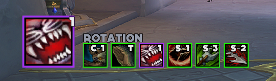
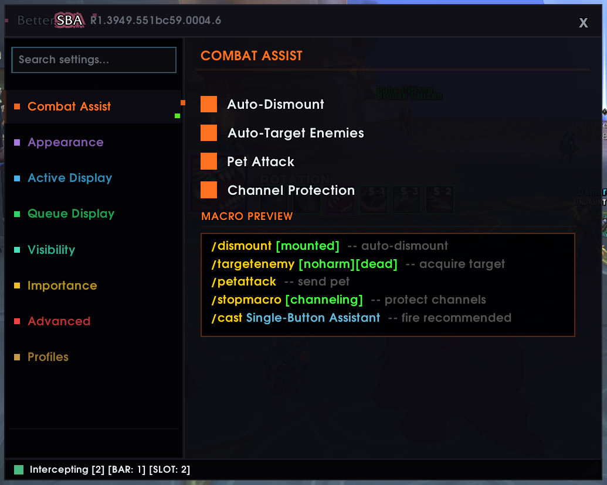
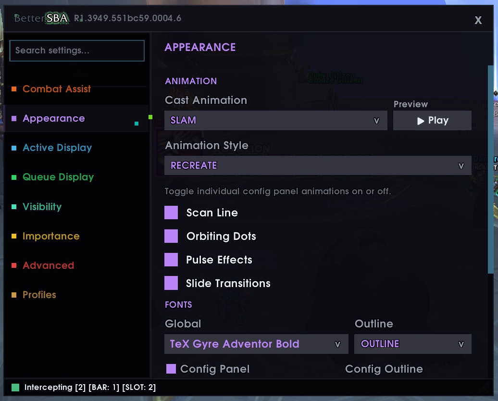
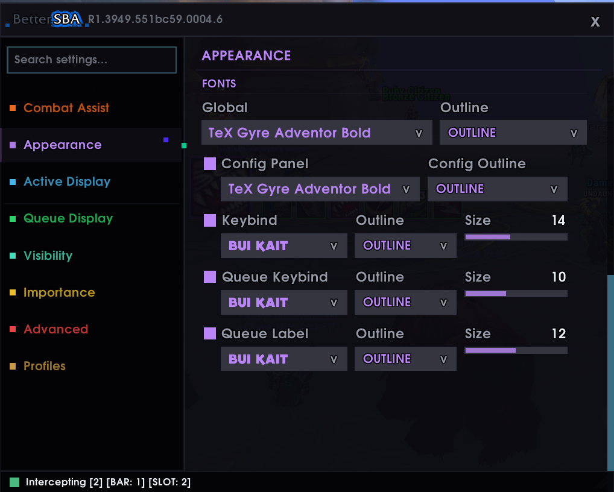
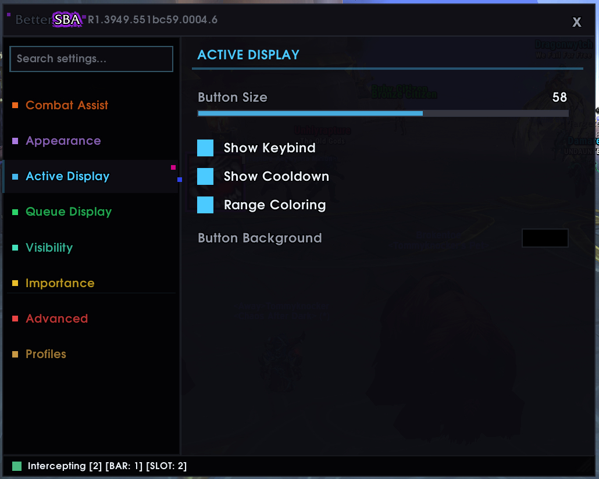
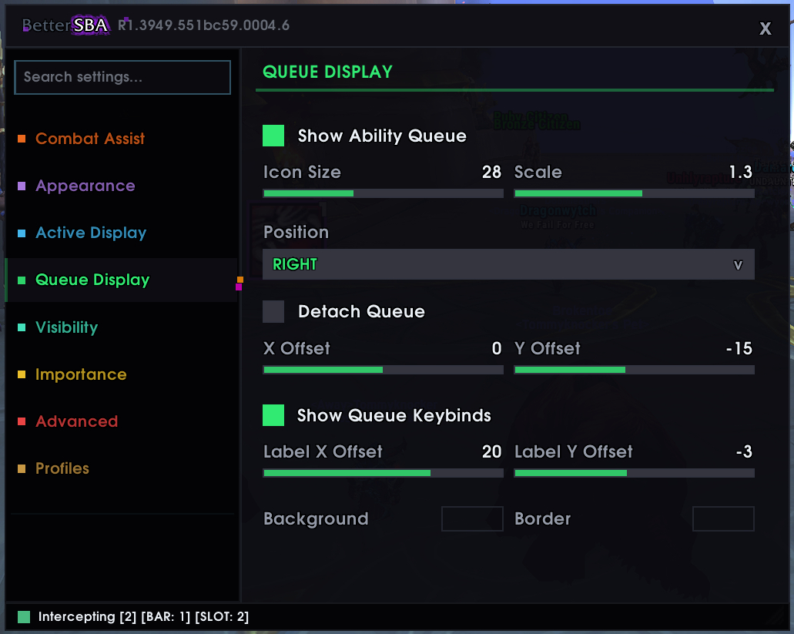
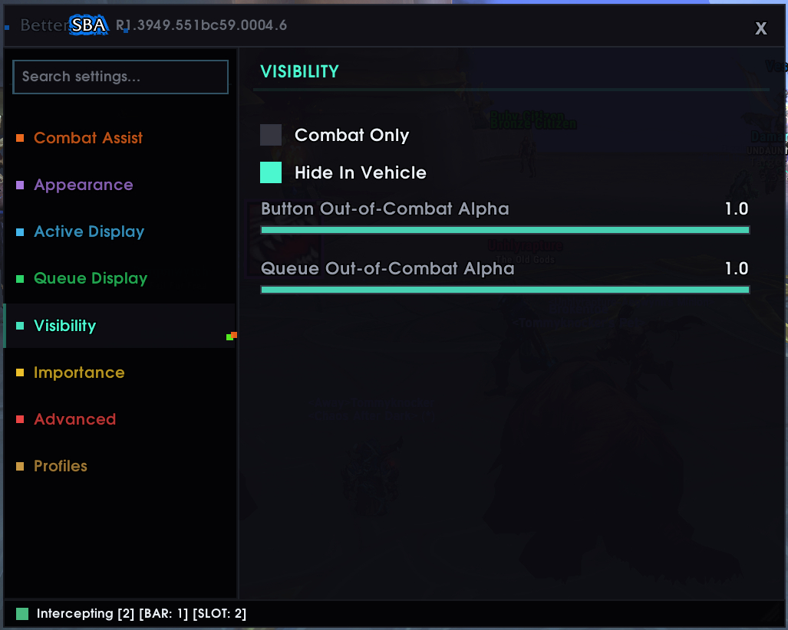
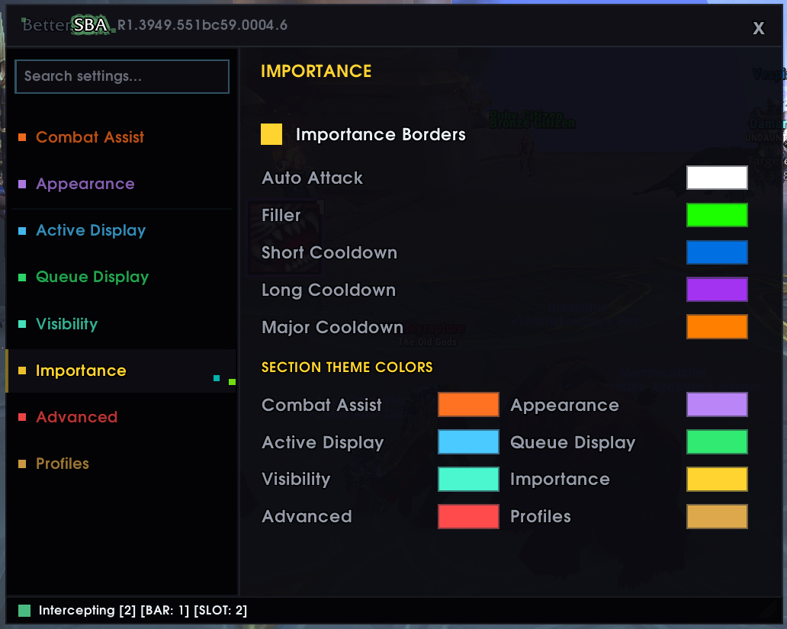
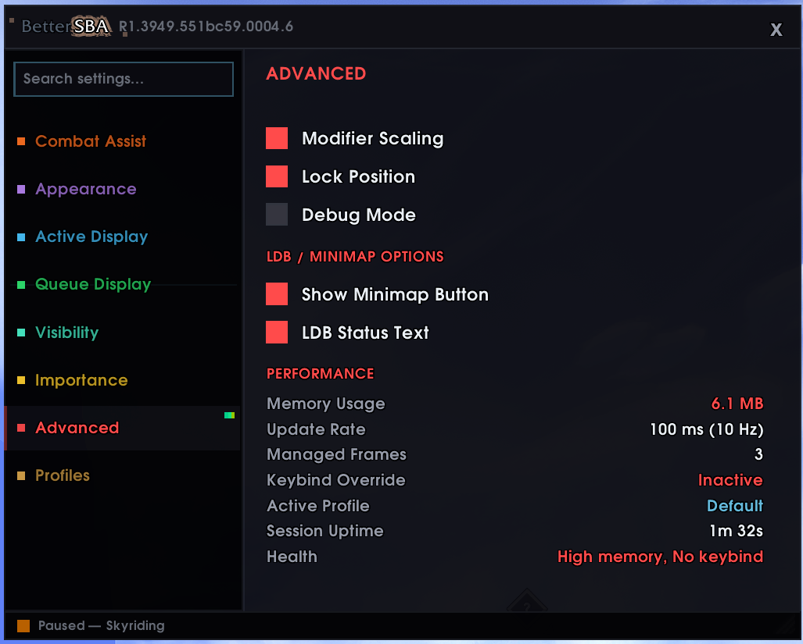
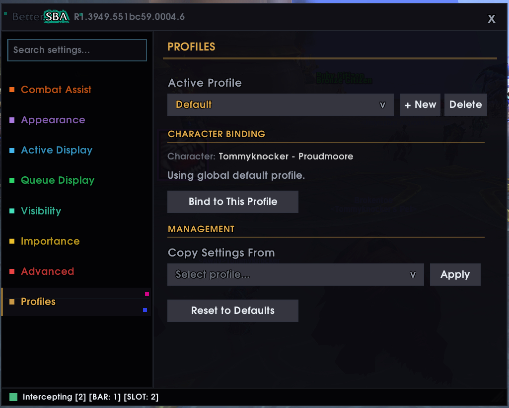

<p align="center">
  
  
  
</p>

<h1 align="center">
  <code style="background:none;border:none;">Better</code><strong>SBA</strong>
</h1>

<p align="center">
  <em>Enhanced Single-Button Assistant for World of Warcraft</em>
</p>

<p align="center">
  <code>/targetenemy [noharm][dead]</code> &middot; <code>/petattack</code> &middot; <code>/stopmacro [channeling]</code> &middot; <code>/cast SBA</code>
</p>

---

## What is this?

BetterSBA wraps the **Single-Button Assistant** (Assisted Combat) into a `SecureActionButton` with `/targetenemy`, `/petattack`, and channel protection baked into one keypress.

Press your keybind &rarr; protect an active channel &rarr; acquire an enemy if needed &rarr; send your pet &rarr; attempt the cast. Target selection uses Blizzard's macro targeting rules.

It also gives you a **rotation queue display** showing your full SBA spell pool with cooldowns, importance borders, and range coloring &mdash; everything the default SBA button doesn't show you.

---

## Screenshots

<p align="center">
  
  <br />
  <em>Main button with rotation queue, importance borders, keybinds, and cooldowns</em>
</p>

| | |
|---|---|
|  |  |
| **Combat Assist** &mdash; auto-target, pet attack, dismount, channel protection, and live macro preview | **Appearance &mdash; Animation** &mdash; cast animation type &amp; style, with live preview |
|  |  |
| **Appearance &mdash; Fonts** &mdash; per-context font, outline, and size with override toggles | **Active Display** &mdash; button size, keybind text, cooldown, range coloring, background |
|  |  |
| **Queue Display** &mdash; icon size, scale, position, detach, offset, keybinds, and border | **Visibility** &mdash; combat-only mode, vehicle hiding, button &amp; queue alpha |
|  |  |
| **Importance** &mdash; cooldown tier border colors and section theme colors | **Advanced** &mdash; modifier scaling, lock, debug, minimap/LDB, and live performance stats |
|  | |
| **Profiles** &mdash; create, switch, copy, reset, delete, and per-character binding | |

---

## Animations

The current development build adds **Motion**, a separate lightweight feedback system with **Pulse**, **Echo**, and **Sweep** presets. Choose it under **Appearance → Cast Feedback**. **Reduced Motion** uses a brief stationary rim flash; **Off** disables cast feedback. **Classic** retains the original clone and particle controls. Preview buttons play once.

**Active Display → Button Style** selects **Soft** (rounded icon, quiet edge lighting, and a readable keycap) or **Classic** (the existing square/Masque appearance). The secure casting overlay stays fixed while feedback animates around the display.

Motion reuses three effect layers and native animation groups. Classic clone frames also remain pooled across settings changes. Configuration drag handlers stop on release/hide, and BetterSBA leaves WoW's shared garbage collector alone. These changes reduce avoidable work; in-game FPS and memory improvements have not been benchmarked.

<p align="center">
  <a href="https://github.com/zero-wow/BetterSBA/releases/download/v0006/POP!_Animation_Example.mp4">
    
  </a>
  <br />
  <em>Example of the POP! cast animation</em>
</p>

We plan on making videos of every animation structure as we fix the code for them to ensure they are working exactly as we intend. As for the POP! Animation, we are aware that the video here doesn't do it justice as we have to turn off some settings that are on by default in-game to make the video recording work right, but those options make the animation itself more overall easier to understand.

---

## Features

<table>
<tr>
<td width="50%" valign="top">

### Keybind Interception
Automatically hooks your existing SBA action bar keybind. The macro fires when you press your normal hotkey &mdash; not just when clicking the BetterSBA button. Works with default bars, Bartender4, ElvUI, and Dominos.

### Rotation Queue
Shows your SBA rotation pool as icons beside the main button. Configurable icon size, scale, position (8 anchor points), per-icon cooldowns, keybind labels, and importance-colored borders based on spell cooldown tiers.

### Cast Animations
5 animation types: **Drift**, **Pulse**, **Spin**, **Zoom**, **Slam**. Two styles &mdash; **Keep** (button stays, clone animates away) or **Recreate** (old icon animates out, new icon fades in). Live preview button in config.

Animated clone keybind text now has its own tuning controls for edge-case setups. The default alignment is intended to be correct for the normal display and common scaling path, but if your Masque skin, font choice, or scale stack still makes the clone hotkey sit slightly off, you can correct it directly in the Animation section with **Clone Keybind X**, **Clone Keybind Y**, **Clone Font**, **Clone Outline**, and **Clone Size**.

### Tank Off-GCD Abilities
Detects your tank spec and learned spells, then optionally attempts Demon Spikes, Shield Block, Ignore Pain, Ironfur, Shield of the Righteous, Rune Tap, or Purifying Brew on your keypress in combat. Ironfur precedes SBA; the other tank actions follow it. These attempts do not choose safe damage windows, maintain a desired buff count, or reserve resources. Each has an individual toggle; unavailable spells are disabled and omitted.

Convoke the Spirits is a separate Druid opt-in, **off for new profiles**. It attempts a channel before SBA and can consume that press instead of the assisted attack. Existing preferences are preserved. Channel Protection stops the whole macro while channeling; turning it off also removes the cast-line channel guards.

### Equipped trinkets
Combat Assist detects both equipped trinkets and their use effects outside combat. Trinket Use defaults to **Off**. **Approved** includes only the exact item/use-spell pairs you individually allow after checking that they are instant, off the GCD, and do not channel. Passive, uncached, cast-time, and unapproved items stay out of the macro. Detection alone cannot prove those properties for every item. The old Verified setting migrates to Approved without losing approvals.

Approved items are attempted after SBA, on your normal keypress, against a living hostile target in combat. Changing equipment does not approve a different item. Protected macro changes made during combat wait until combat ends. The macro preview uses the same action list as the secure button.

### Cooldown compatibility

Optional **Manual Cooldown Reminders** appear beside the active display only for
reviewed catalog targets that explicitly leave a named cooldown to the player.
They use Blizzard's native cooldown sweep and never cast the spell; unavailable
or secret cooldown state is shown as unknown instead of ready.
Blizzard's recommendation remains authoritative. Restricted cooldown information stays unknown to addon logic and is passed through supported native cooldown rendering. Priority icons use stable base-cooldown importance rather than a locally predicted rotation.

### Profiles
Multiple named profiles with per-character bindings. Create, copy, rename, reset, and switch profiles. All characters share a global default unless overridden. Settings migrate automatically from older versions.

### Search Settings
Type to filter across all config sections. Matching options highlight instantly &mdash; no scrolling through menus to find what you need.

</td>
<td width="50%" valign="top">

### Importance Borders
Spells auto-classified by base cooldown duration:
| Tier | Cooldown | Default Color |
|------|----------|---------------|
| Filler | < 10s | Green |
| Short CD | 10&ndash;30s | Blue |
| Long CD | 30&ndash;120s | Purple |
| Major CD | > 120s | Orange |

All tier colors and section theme colors are fully configurable with color pickers.

### Range Coloring
Icon desaturates red when your target is out of range. Instant visual feedback without needing a tooltip.

### Pause Detection
Automatically pauses interception during vehicles, skyriding, and unsupported override bars. Normal ground mounts remain interceptable when Auto-Dismount is enabled; otherwise mounting pauses interception. A visible pause overlay shows the reason.

### Per-Context Font System
Independent font family, outline style, and size settings for: global, config panel, keybind text, queue labels, queue keybinds, pause symbol, and pause reason. Each context has an override toggle to inherit from the global font or use its own.

</td>
</tr>
</table>

---

## Install

1. Download the latest release from [Releases](../../releases)
2. Extract `BetterSBA/` into your `Interface/AddOns/` folder
3. `/reload` in-game
4. Type `/bs` to open the config panel

**Requires:** WoW Midnight (12.x) with Assisted Combat / SBA enabled in your specialization settings.

---

## Configuration

The config panel (`/bs`) uses a compact toolbar with search, nine horizontal tabs, and full-width settings pages. Label/value rows, rounded fields and switches, and paired trinket slots replace the old sidebar layout. **Jump to section** opens subsection shortcuts; the footer shows panel zoom and resets it to 100% when clicked.

The new layout resets the old panel zoom once to 100%. Later zoom adjustments are saved. Screen-fit scaling and pixel-aligned rules adapt to WoW's UI scale and available screen space. Gameplay settings, profiles, and font overrides are retained.

The panel is organized into nine sections:

| Section | What It Controls |
|---------|-----------------|
| **Combat Assist** | Auto-target enemies, pet attack, auto-dismount, channel protection, tank off-GCD abilities (per-spec), live macro preview |
| **Appearance** | Cast animation type &amp; style, animated clone keybind controls, per-context font system (global, config panel, keybind, queue label, queue keybind, pause symbol, pause reason) |
| **Active Display** | Button size, show/hide keybind text, keybind X/Y offset, show/hide cooldown spiral, optional manual cooldown reminder, range coloring toggle, button background color |
| **Priority Display** | Show/hide the spell pool, icon size, scale, anchor position, detach &amp; drag-to-move, offsets, keybind labels, background &amp; border colors |
| **Talent Builds** | Choose a leveling target, automatically spend new points, see specific mismatch warnings, respec toward an SBA target, undo a confirmed respec, and manage imports |
| **Visibility** | Combat-only mode, hide in vehicle, button out-of-combat alpha, queue out-of-combat alpha |
| **Importance** | Enable/disable importance borders, cooldown tier colors (auto-attack, filler, short, long, major), section theme colors for each config panel tab |
| **Advanced** | Modifier scaling (Shift/Ctrl/Alt size multiplier), lock button position, debug mode, minimap button toggle, LDB status text, live performance stats (memory, update rate, managed frames, keybind status, active profile, session uptime, health) |
| **Profiles** | Active profile dropdown, create new / delete profiles, per-character binding, copy settings from another profile, reset to defaults |

---

## Automatic talent points

Open **/bs → Talents**, select a build for your current specialization, click **USE FOR LEVELING**, and turn **AUTO-SPEND** on. BetterSBA spends and applies available points toward that build without asking for approval for each point. The setting and target are saved separately for each character and specialization. With auto-spend off, **SPEND NEXT** applies one available rank.

The Blizzard talent window also shows an illustrated **SBA: SPEND ALL** button beside Apply, with hover, pressed, and disabled states plus a text label and explanatory tooltip. Once a current-spec leveling target is selected, one click spends every currently legal class, specialization, and available hero point toward it, then commits the batch once. If learned talents conflict with the target, the same button resets and rebuilds the allocation using the points available at your current level; the confirmed respec can be undone. Combat, pending edits, and a changed target/tree stop the action with a reason.

Selecting a catalog row only previews it. With a current-spec row selected, clicking **AUTO-SPEND: OFF** saves that row as the leveling target and turns auto-spend on in one action. The button stays clickable when no target is saved: missing or invalid selections produce an explanation in chat and the leveling panel instead of an inert control. The older **USE FOR LEVELING** action still sets a target without enabling automatic spending.

The build catalog includes 28 distinct 12.1 talent exports from the **Talent build** field of [LazyGrip sequence pages](https://lazygrip.net/browse), under a LazyGrip source filter. These are WoW talent strings, separate from LazyGrip's `!GRIP1!`/`!EMS1!` rotation-sequence imports. They are labeled as source-published talents with **unverified SBA suitability**. LazyGrip's explicitly named Super SBA sequences were marked 12.0.7 at this review and did not publish a structured Talent build field, so they are not mislabeled as 12.1 SBA talent targets.

**AUTO-SPEND** adds points to the current allocation without resetting talents or changing specialization. It waits during combat, while another build is importing, or while you have uncommitted talent edits. Conflicting learned talents pause the assistant with a status message. Changed client builds, tree hashes, or target exports require reselecting the target. Failed or unconfirmed commits stop the pass; review pending talents before toggling auto-spend to retry.

The optional **mismatch warning** compares your learned talents with the chosen SBA target and names learned talents, extra ranks, or choices that conflict. Enable it separately for each character and specialization. A mismatch means the allocations differ; it does not prove your current talents are bad or that the target performs better. Turning the warning on does not reset anything.

To replace a conflicting allocation, click **RESPEC TO SBA**. This explicit action resets the current specialization's purchased class, spec and hero talents, then spends the points available at your current level toward the chosen target. It does not grant max-level points or switch specialization. Review the target and its source notes before using it; the reset replaces your current allocation. Auto-spend can continue that target as you earn more points. After a confirmed respec, **UNDO RESPEC** restores the saved prior ranks and choices in one commit. Undo is available only while that respec's result remains unchanged on the same character, spec, build and talent tree. A successful undo turns auto-spend off so it does not immediately reapply the SBA target.

Catalog row clicks only inspect a build. **APPLY BUILD** remains an explicit full-loadout import, and **LOAD ANYWAY** explicitly switches to an off-spec build. Old automatic full-loadout imports on login/level-up have been retired; existing personal imports remain available.

**VIEW SOURCE** shows the guide link, patch, research date, hero tree and author limitations for sourced builds. **BUILD NOTES** shows provenance and compatibility notes when a build has no source URL. The bundled catalog has **51 entries across 26 specs**: four publisher-designated SBA builds, four author-endorsed SBA-compatible builds, one Fire Mage adaptation, fourteen exact general-guide exports inferred as SBA candidates from spec-level guidance, twenty-two exact user-supplied SBA targets, and six unverified legacy Druid imports. The corrected Blood leveling/delves/dungeons code replaces the earlier supplied version; the Blood raid code remains separate. User-supplied “meta” labels are preserved as attribution, without an independent performance rating or patch claim. The Fire adaptation changes only the Flamestrike choice to its targeted variant. The inferred imports are not publisher-endorsed SBA builds or in-game-verified results. The addon does not fetch websites inside WoW. Fourteen specs still lack a bundled target, and hero/content coverage remains incomplete.

A max-level import has no leveling chronology. BetterSBA has **78 guide-informed priority rules across 11 specs**, including a Blood Death Knight profile scoped to the two supplied Blood targets. Rules apply only to matching talents in the selected target and promote the prerequisites leading to those talents. The next-pick status explains the reason. Explicit rank orders take precedence; unweighted talents use a stable legal path. Every acquisition weight is an inference from class/SBA guidance, not an author-published leveling order or a simulated optimum. Newly supplied builds without a matching priority profile use a stable legal path. Some rules may not occur in a particular target; those rules are ignored. Class/spec/hero currency, level gates and the active hero tree still determine what can be learned. Healer builds do not make SBA perform automatic healing; healing decisions remain manual.

The [source research and coverage](docs/sba-talent-sources.md) records the available SBA evidence and the process for evaluating general builds with SBA-mode simulations. The [user target audit](docs/user-sba-targets-20260924.json) retains the exact supplied import bytes and offline spec, hero-tree and talent-identity checks. Inferred general-guide and user-supplied exports are labeled in the catalog so you can inspect their limitations before selecting them. Automated Lua tests exercise spending/confirmation, conflicts, combat delays and layout; these checks do not replace in-game validation.

---

## Slash Commands

| Command | Action |
|---------|--------|
| `/bs` | Open config panel |
| `/bs lock` | Lock button position |
| `/bs unlock` | Unlock button position |
| `/bs toggle` | Enable / disable addon |
| `/bs reset` | Reset button position to center |
| `/bs macro` | Print current macrotext to chat |
| `/bs debug` | Toggle debug output |

Also responds to `/bsba` and `/bettersba`.

---

## How It Works

```
+-------------------------------------------+
|  Your Keybind ("2")                       |
|    |                                      |
|  SetOverrideBindingClick                  |
|    |                                      |
|  BetterSBA SecureActionButton             |
|    |                                      |
|  macrotext:                               |
|    /dismount [mounted]                    |
|    /targetenemy [noharm][dead]            |
|    /petattack                             |
|    /stopmacro [channeling]                |
|    /cast Single-Button Assistant          |
|                                           |
|  Display Layer (non-secure):              |
|    Icon <- C_AssistedCombat API           |
|    Cooldown <- event-driven cache         |
|    Border <- base CD classification       |
|    Range <- C_Spell.IsSpellInRange        |
+-------------------------------------------+
```

BetterSBA uses a **dual-frame architecture**: the secure action button handles all protected casting operations, while a separate display frame freely updates textures, cooldowns, and visibility without triggering combat lockdown taint errors.

The addon intercepts your existing SBA keybind using `SetOverrideBindingClick`, so pressing your normal hotkey routes through BetterSBA's macro instead of the default action bar slot. This gives you auto-targeting, pet attack, and channel protection on every press &mdash; even when using the original keybind.

Macro lines are configurable and rebuilt dynamically out of combat. Changes made during combat are queued and applied when you leave combat.

**Zero-GC Architecture** &mdash; BetterSBA never calls `collectgarbage()`. All caches use reusable tables and event-driven invalidation to minimize memory churn. Lua's built-in incremental GC handles collection naturally without forced steps that cause microstutters.

---

## Animated Clone Keybind Alignment

The cast animation system uses a virtual animated clone of the Active Display so the outgoing icon and its keybind text can move without touching the secure casting button.

For most setups, the default clone keybind alignment should now be correct without any extra work. If your clone hotkey still looks slightly off, it is usually caused by a skin, font, or scale combination changing the apparent icon bounds during the animation.

If that happens, go to:

- `/bs`
- `Appearance`
- `Clone Keybind X`
- `Clone Keybind Y`

These are **adjustments added on top of your main Active Display keybind offset**, not replacements.

Use them slowly:

- `+X` moves the animated clone keybind **right**
- `-X` moves it **left**
- `+Y` moves it **up**
- `-Y` moves it **down**

The safest way to tune it is 1 pixel at a time while using the animation preview button or a live cast until the clone text visually matches the main display.

If you still see a mismatch, you can also tune:

- `Clone Font`
- `Clone Outline`
- `Clone Size`
- `Masque Skin Animated Clone`

Those controls only affect the virtual animation clone. They do not change the secure SBA button or the main Active Display keybind text.

---

## Profile System

- **Global Default** &mdash; all characters share the "Default" profile unless overridden
- **Per-Character Binding** &mdash; assign any character to a specific profile independently
- **Create &amp; Copy** &mdash; create new profiles from scratch or copy settings from existing ones
- **Reset to Defaults** &mdash; restore any profile to factory settings with one click
- **Automatic Migration** &mdash; existing flat `BetterSBA_DB` settings migrate seamlessly to the new profile format on first load

---

## Optional Dependencies

| Addon | Integration |
|-------|-------------|
| **Masque** | 3 skinning groups: Main Button, Rotation Queue, Animated Button |
| **LibSharedMedia** | Full font library access in all font dropdowns |
| **LibDBIcon** / **LibDataBroker** | Minimap button with intercept status and pause state |
| **Bartender4** / **ElvUI** / **Dominos** | Keybind scanning + automatic interception |

All dependencies are optional. BetterSBA is fully self-contained with no required libraries.

---

<p align="center">
  <sub>built for midnight &middot; no ace3 &middot; no libstub &middot; fully self-contained</sub>
</p>
